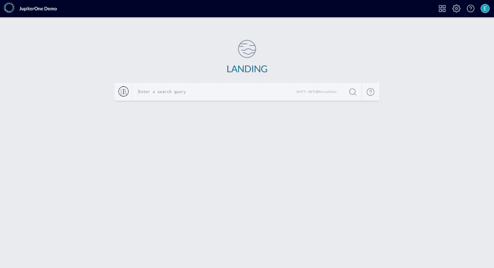

# JupiterOne 2019.30 Release

2019-09-30

## New Features

- Added **J1QL docs in-app** to the Query Library. you can access the docs with
  the Library open side-by-side as you run queries.
  
  You can even try any of the queries mentioned in the docs directly — just
  click the play button next to a query!

  

- Other updates in the **Landing** app:

  - Added support to **page through >250 rows** in query results from the
    Landing webapp.

  - Added shortcut/action button to create an Alert rule directly from query
    result.

  - Added shortcut to edit a saved question directly from question results.

  - Saved and Packaged (pre-loaded) questions are now combined under one tab in
    the Query Library. You can toggle the view to include/exclude packaged
    questions in the view.  Additionally, you can now edit or delete packaged
    questions.

- Added the ability to **view historic data** associated with an entity that has
  raw JSON data stored (most, not all, entities currently have raw data saved).

  - The **History view** can be invoked from the entity properties menu, either
    within the Asset Inventory view or the Graph view. Selecting "History" from
    the dropdown actions menu will open up a modal where you can view previous
    versions of the entity JSON (if available).

  - Within the History view, you can select two versions of JSON data for a
    side-by-side or inline comparison (**Diff view**).

- Updates in the **Compliance** app:

  - Added **bulk evidence download** capability in compliance app.

    Clicking on the "Download" button for a selected compliance standard will
    trigger a build of all available compliance evidence in the background. You
    will receive an email notification with a link when the package is ready for
    download.

    Current limitation: if an evidence query generates more than 250 results,
    the bulk download only includes the initial 250 results as sample output.
    This is done as a trade-off so that the evidence package can be generated
    relatively quickly. This sampling is sufficient for audits/assessments in
    most cases. Evidence download directly from a specific requirement will
    include the full results.

  - You can add a new query question directly within the compliance requirement
    details view and have it mapped to the selected requirement/control.

- Added filter support for the "Type" column in Alerts > Open Vulns & Findings
  view.

- Added support to delete an alert rule, in addition to disabling the rule.

- Support custom fields in Jira action of an alert rule, via the
  `additionalFields` object. This must be configured with the advanced (JSON)
  rule editor.

- J1QL now supports non-alphanumeric characters in the property names, by
  wrapping the name in brackets. e.g. --
  
  - `Find Host with [special-prop-name]='abc'`
  - `Find Host as e return e.[special-prop-name]`

## Integrations

- **AWS**

  - Added capability to **detect leaked secrets/credentials** in CloudFormation
    Stack parameters and outputs. Run the following query to find them:

    ```j1ql
    Find aws_cloudformation_stack with secretsDetected=true
    ```

    Detected secrets will be masked as `****REDACTED****` in the parameters /
    outputs.

- **Azure**

  - Added the following entities and their corresponding relationships:
    `azure_vm`, `azure_nic` and `azure_public_ip`.

    See [Azure integration docs][docs-azure] for more details.

## Improvements and Bug Fixes

- Fixed UI pointer when you mouse over a Group name in Users & Access view.

- Fixed broken link in the Policy Builder / edit view to go back to policies.

- Fixed a query language bug where negation on property filter did not work when
  the property value is an array.

- Fixed an issue where arrays were incorrectly converted to comma separate
  strings when indexed.

- Improved how query parsing is handled with complex filter conditions and
  parenthesis.

- Fixed an issue where empty string was incorrectly handled by the mapper.

- Improved layout of the alert rule editor.

## Community Projects

_Community resources are provided AS IS. Code contributions and forks welcome._

- Added examples using JupiterOne to enforce code reviews and security code
  scanning in CI/CD pipeline. See:

  - <https://github.com/JupiterOne/change-management-client>
  - <https://github.com/JupiterOne/change-management-example>

- Added example training template (for HIPAA awareness) and how to capture
  employee training records in YAML for custom internal training and publish to
  JupiterOne graph. See:

  - <https://github.com/JupiterOne/security-training-templates>

- Open sourced a tool to detect specific type of pull request and alert the
  security team in Slack. See:

  - <https://github.com/JupiterOne/bitbucket-pr-detector>

[docs-azure]: ../docs/integrations/azure/graph-azure.md
