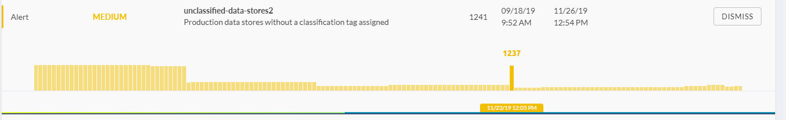
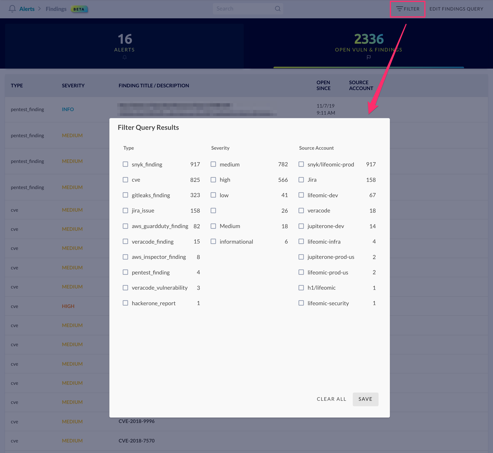

# JupiterOne 2019.35 Release

2019-12-10

## New Features

- Exciting new capabilities added to **alert rules**, including:

  - Added ability to **include detailed data from alerts in alert actions**.
  
    > For example, if multiple S3 buckets were part of an alert, you can add the
    bucket name and other details of each bucket to the email body or the
    description of a Jira ticket.
  
  - Added **webhook** support to alert action. For example:

        ```json
        "actions": [
          {
            "targetValue": "HIGH",
            "type": "SET_PROPERTY",
            "targetProperty": "alertLevel"
          },
          {
            "headers": {
              "Authorization": "Bearer abc"
            },
            "endpoint": "https://my-site.com/my-route",
            "type": "WEBHOOK",
            "method": "POST",
            "body": {
              "one": 1,
              "two": 2
            }
          }
        ]
        ```
  
  - Simplified **JavaScript-like syntax** for rule conditions.

        _Before:_

        ```json
        "condition": [
          "AND",
          [
            "queries.query0.total",
            "!=",
            0
          ]
        ]
        ```

        _Now:_

        ```json
        "condition": "{{queries.query0.total != 0}}"
        ```

  For more information on these new capabilities and how to configure, see
  [alert rule schema](../docs/schemas/alert-rule.md).

- **Alert trend histogram** is now displayed with relatively scaled bar height
  and supports greater number of data points.

  

- New **Filter Selection** modal for **Vulnerability Findings** view that
  supports applying multiple filters on `type`, `severity`, and `source account`
  of vulnerability findings.

  

## Integrations (and "Power Ups")

- Upgraded **J1 Endpoint Compliance Agent to Stethoscope v4**, which adds
  support for required application auditing policy.

  See details [here](../guides/endpoint-compliance-agent-v4.md).

## Improvements and Bug Fixes

- Significant load time performance improvement to the Asset Inventory view.

- When an entity is selected in query results that opens up the property panel,
  the property panel now auto expands the view height as needed.

- Performance and scalability improvements to integration pipeline

- Various other backend improvements
