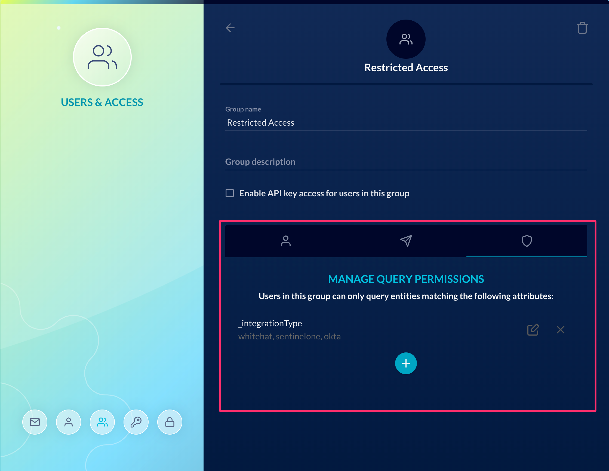

# JupiterOne 2019.36 Release

2019-12-23

## New Features

- Lots of UI/UX updates to the **Insights app**:

  - Added the ability to drag-n-drop an Insights board to re-arrange them in the
    menu side drawer.

  - Added the ability to clone a board. Admin users can also clone a board and
    save it as a new shared/team board.

  - Improved UX for adding and updating boards.

- Many UI/UX updates to the **Alerts app** as well:

  - Visual rule editor now supports updated rule actions, including **Webhook**
    action, **email body**, and **templates** definitions.

  - Visual editor now works when editing an existing rule. Previously editing
    was only supported via the advanced JSON rule editor.

- [ENTERPRISE accounts only] Added the ability to **set query permissions** for a
  user group, which applies a filter constrain on the data users in that group
  are allowed to query. Permission filters can be configured by:
  
  - Entity Class
  - Entity Type
  - Integration Class
  - Integration Type
  - Integration Configuration Instance

  

## Integrations

- [beta] **CrowdStrike Falcon** integration first release!

  See [CrowdStrike integration doc](../docs/integrations/crowdstrike/index.md)
  for details.

## Improvements and Bug Fixes

- Various UI bug fixes and UX improvements to the Alerts and Compliance apps

- Fixed an issue where the "Control Provider" value for a policy procedure
  document was not successfully saved from the editor

- Fixed an issue where duplicate vulnerability finding rows would open when a
  single finding was selected

- Improved data deletion pipeline
