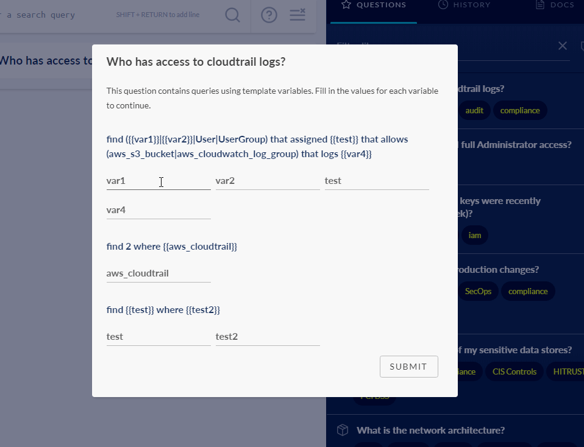

# JupiterOne 2020.39 Release

2020-02-11

## New Features

- **Interactive questions with variables** - save a question with `{{variable}}`
  in the queries will prompt users to enter the value for each variable when
  the question is asked.

  

- Non-traversal queries (i.e. queries without relationships) now returns
  `totalCount` in the JSON API response.

- Added a **Compliance Summary Overview Dashboard** in the Compliance app. This
  provides an aggregated view of status from all compliance standards and
  security review questionnaires. Additionally,

  - Added **summary display for security questionnaires**.

  - Improved gap analysis logic and display.

  - Improved support for "Not Applicable" items in compliance evidence
    download and summary status.

## Integrations

- [AWS] Added **WorkSpaces** support.

  - Also added a workaround to an issue with the `route53.listTagsForDomain` API
    where AWS is applying an effective rate limit far less that the documented
    5 requests/sec.

- [Azure] Added **Databases** support, including **MariaDB**, **MySQL**,
  **PostgreSQL**, and **SQL Server**.

  - Also fixed an issue when handling blob storage containers from multiple
    blob storage accounts.

- [Crowd Strike] Improved error handling of unstable provider APIs.

- [Tenable] Fixed an issue where the integration run was not completing for
  certain accounts.

- New integration instances are now limited to ONE_HOUR or ONE_DAY polling.
  THIRTY_MINUTES is no longer supported. This is a step towards supporting
  streamed/event-based data ingestion in the near future.

## Improvements and Bug Fixes

- Grouped aggregation with relationship traversal is supported.

  e.g. `Find Host that USES Disk as d RETURN d.volumeId, count(d)`
  
  This was previously returning individual rows with `1` as the the count.

- Query aggregation now supports grouping when the grouped by property is an
  array. The array is counted/displayed as comma separated values.

- Fixed an issue where `tag.AccountName` was not updated when the integration
  name changed.

- Fixed issue when querying deleted data from the Landing page.

- Added prompt to reload graph after an entity is edited or deleted from the
  query result graph view.

- Datetime numbers are now parsed into human-readable ISO datetime string in CSV
  downloads from compliance evidence or query result.

- Fixed incorrect count and bar height in the trend display of an alert.

- Fixed incorrect query being populated when creating an alert from Landing page
  query results.

- Added default values to Send Email and Create Jira Ticket alert actions.

- Improved auto-complete to handle editing previous parts of a query.

- Performance improvements of the property filters in Asset Inventory.

- Improved UI error handling, including an error reporting view in the case an
  app fails to load.

- Fixed an issue that prevented the Policies app from loading for certain users.

- Lots of backend improvements.

- Fixed some mapping issues.
