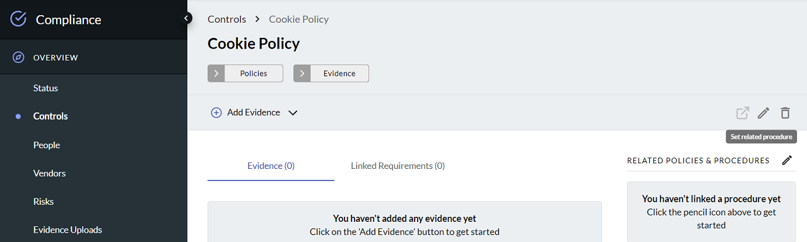

# JupiterOne 2020.40 Release

2020-03-02

_Another Sprint focused on tech debts. Light on new features._

## New Features

- Added the ability to generate a shareable URL to a Question from Landing page.

- Added the ability in the Compliance webapp to create mapping of policies and
  procedures to a selected compliance requirement, with recommendations based on
  a deep neural network text classifier.

  

- Added version number and creation/update timestamps display to policies and
  procedures UI.

## Integrations

- **[AWS]** Auto-configure AWS integrations of sub-accounts connected to an
  organization master account.

  Enable this by checking **Configure Organization Accounts** under "Advanced
  Options". All sub-accounts must be configured to use the same role name and
  external ID as the master account for this to work properly.

- **[Azure]** Added analysis of **Security Group Rules**. Try:

    ```j1ql
    Find azure_security_group
      that ALLOWS (Host|Network|Service)
    Return tree
    ```

  - Also added support for **VM Disks** and **Custom Images**.

## Improvements and Bug Fixes

- Lots of small improvements and fixes. Too many to list individually.

- Separated rate limit for APIs and webapps so that custom automation will not
  cause user experience issues on the webapps.

- Improved alert rule editor for creating Jira tickets.
