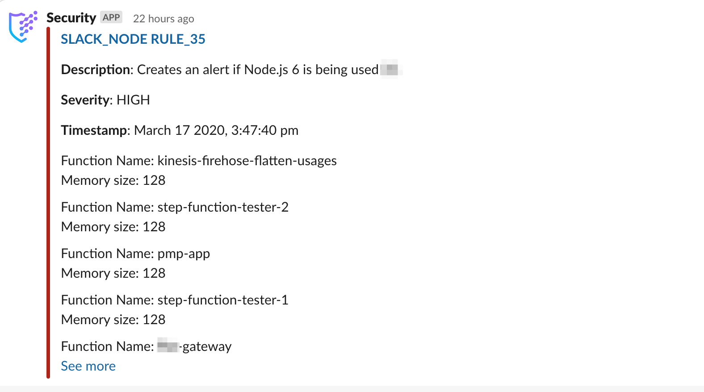

# JupiterOne 2020.41 Release

2020-03-17

## New Features

- Added **evidence upload** capability to Compliance app.

- Much improved **Slack message formatting** from JupiterOne alerts. See example
  alert below. The message title links to the alert in the JupiterOne web app.

  

  The alert above is configured with the following `slackBody` template and
  action:

    ```json
    "templates": {
      "slackBody": "Function Name: {{item.functionName}}\nMemory size: {{item.memorySize}}\n\n"
    },
    ...
    "operations": [
      {
        ...
        "actions": [
          ...
          {
            "type": "SEND_SLACK_MESSAGE",
            "body": "{{queries.query0.data|mapTemplate('slackBody')|join(' ')}}",
            "webhookUrl": "https://hooks.slack.com/services/ABC/DEF"
          }
        ]
      }
    ]
    ```

  Additionally, `{{alertWebLink}}` is available as a variable that can be
  referenced in rule templating.

  > 🤫 _Don't tell anyone yet: a JupiterOne Slack app is coming soon!_

## Integrations

- **[Okta]** Added raw data capture for Okta entities.

- **[Tenable Cloud]** Added additional fields to Finding and Vulnerability
  entities ingested from Tenable Cloud API, including `description`, `synopsis`,
  `solution`, `priority`, `numericPriority`, etc. when available. Also fixed
  incorrectly assigned values to `severity` and `numericSeverity`.

## Improvements and Bug Fixes

- Improved auto-complete to not make suggestions after quotation marks.

  _Note: Query auto-complete is now enabled by default for new users._

- Fixed an issue with the Github app installation flow during integration setup.

- Fixed an occasional timeout issue with Snyk integration.

- Added more end-to-end testing and monitoring to improve platform health check.
