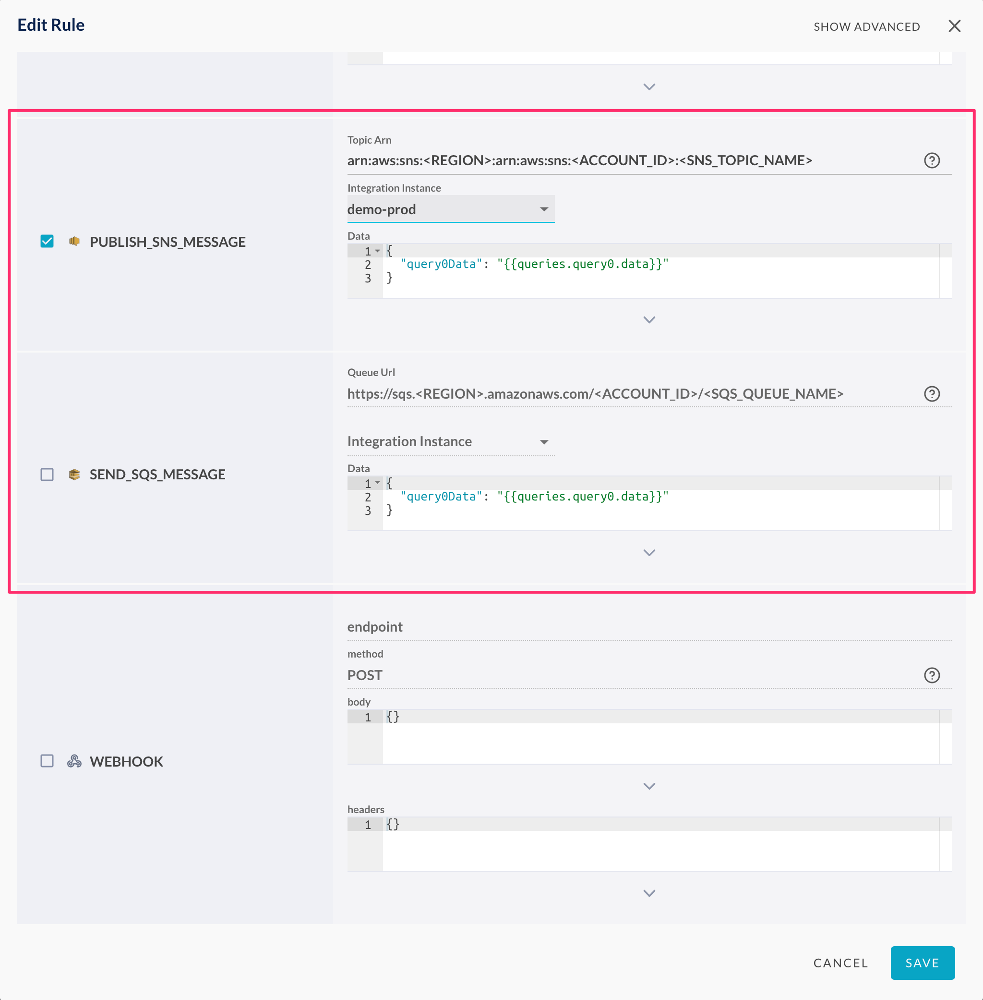
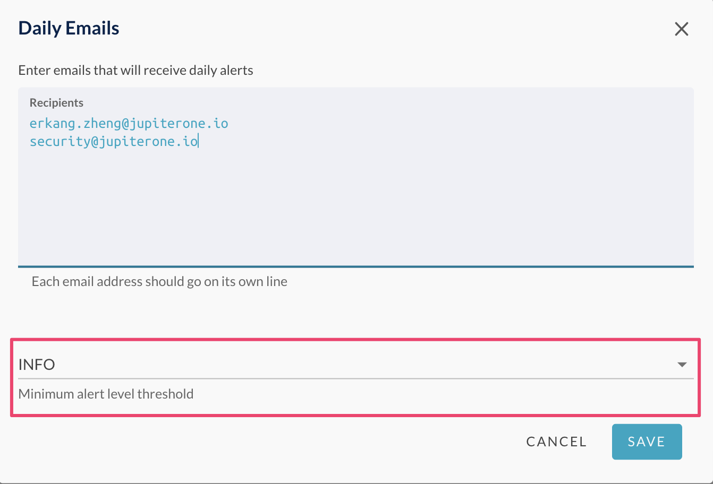

# JupiterOne 2020.42 Release

2020-03-30

## New Features

- Introducing **default alias** in query language. This simplifies query writing
  in most scenarios.

  For example, the following query:

    ```j1ql
    Find User as u that is Person as p
      return u.username, p.displayName, p.manager
    ```

  This can be simplified to:

    ```j1ql
    Find User that is Person
      return User.username, Person.displayName, Person.manager
    ```
  
  > The **Class** or **Type** of an entity can be used directly as the
  > **default alias**.
  >
  > Note that this does not work if you reference the same Class or Type of
  > entity more than once in the same query.

- Added support to configure **granular access policies** associated with a
  J1 user group.
  (A few more iterations to come this sprint to fully support this capability)

- Added support to capture detailed **audit trail**.
  (UI coming soon for account admins to view audit trails)

- Added support to **send SQS message** to a queue and **publish SNS message**
  to a topic in **alert rule actions**. This can be used to trigger custom
  automation.

  > Note: in order to use this capability, the JupiterOne integration role for
  > the target AWS integration must be assigned `sns:Publish` and/or
  > `sqs:SendMessage` permissions in an attached IAM policy.

  

- Added configurable **minimum alert level threshold** in **Daily Digest**
  emails. Only alerts above this set threshold will be counted and included
  in the daily emails.

  

- Added support to query internal J1 entities via graph query, including J1
  users, groups, and (soon) API access keys. This will support setting up alert
  rules for relevant resources (e.g. Alert when J1 API keys are near expiration).

## Integrations

- **[VMWare AirWatch]** Rolled out initial version of AirWatch integration! See
  [docs](../docs/integrations/airwatch/index.md) for details.

- **[AWS]** Added support for `ElastiCache`, `Elasticsearch`, and `SNS`. See
  [docs](../docs/integrations/aws/index.md) for details.

  Also, AWS **Organizations** support is fully functioning, with properties and
  tags of sub-accounts properly captured. (Thanks to improvements made in the
  system mapper.)

- **[Azure]** Added support for `Load Balancers` and relationships to the IP
  interfaces they connect to in the backend. See
  [docs](../docs/integrations/azure/graph-azure.md) for details.

- **[Crowd Strike]** Added ingestion of additional agent properties, including
  `deviceId`, `macAddress`, `publicIp`, `osVersion`, `platform`, and
  `first/lastSeenOn` timestamps.

- **[Github]** Implemented a workaround to a Github GraphQL error on a specific
  organization query. Github engineering team acknowledged the issue on their
  side but did not provide a timeframe on fix.

## Improvements and Bug Fixes

- Fixed a number of bugs in the **Insights** app -- it is now officially out of
  beta!

- Performance improvements on **Landing** page.

- Significant **Mapper** performance improvements and bug fixes. Also added
  support to enrich properties of a target entity that is not created by the
  mapper or the source integration.

- Fixed a bug in **Compliance** where the "no gap" and "no policy" evidence
  filter did not work upon initial page load.

- Fixed a navigation error using "<" ">" buttons in **Compliance** requirements
  view.

- Improved API throttling in `jupiterone-client-nodejs`, the CLI, and
  `security-policy-builder`

- Added `upsert` entity support to JupiterOne CLI (part of
  `jupiterone-client-nodejs`).
