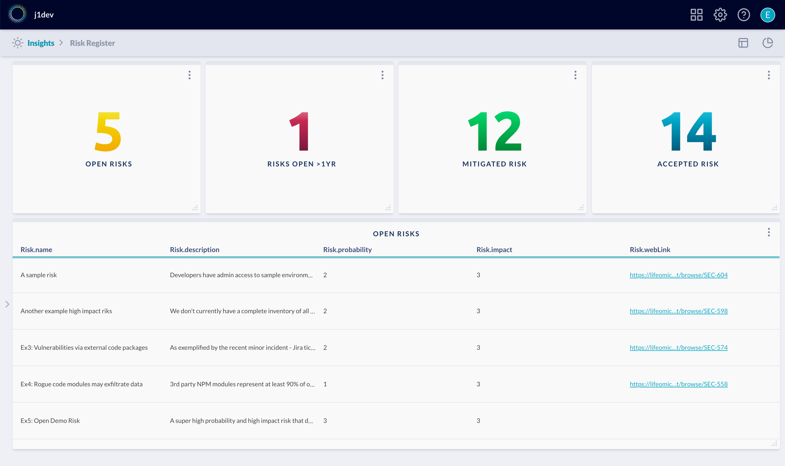
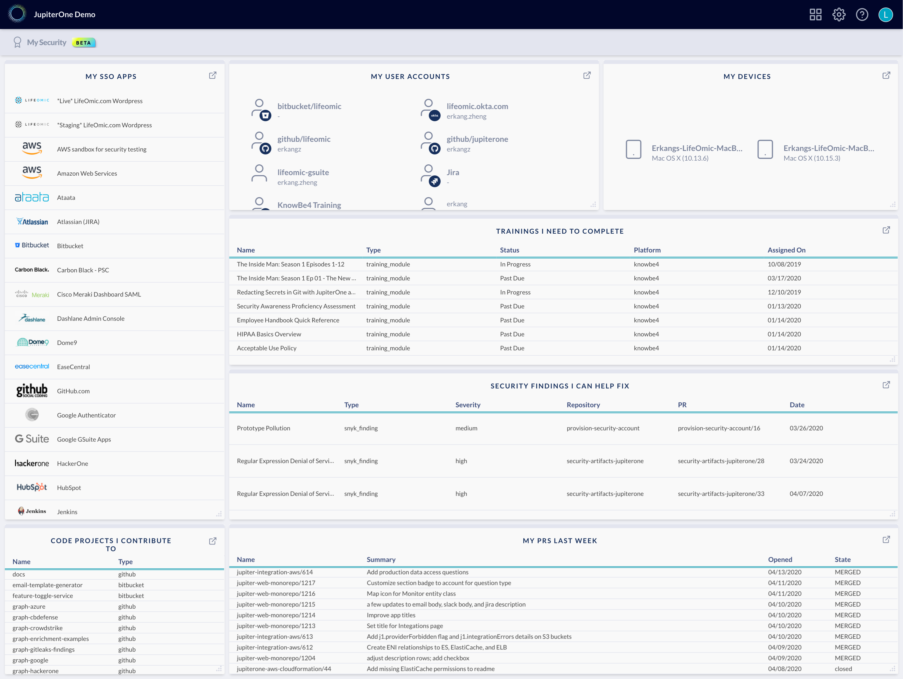

# JupiterOne 2020.43 Release

2020-04-14

## New Features

- Let there be color! Introducing **conditional color settings** of the number
  value in an Insights widget.
  
  This allows you to build more visual dashboards like the _Risk Register_
  example below:

  

  > Check out a corresponding blog of our internal risk assessment automation:
  > <https://jupiterone.com/blog/building-streamlined-cyber-risk-assessment-process-using-jira-and-jupiterone/>

- Interface to configure app access for each user group/role:

  

  See [this doc for more details](../docs/jupiterone-access-controls.md).

  > This is an early access feature of PLUS/ENTERPRISE subscription tier.
  > Contact your account manager to request access.
  >
  > BASE subscription tier accounts will continue to have the basic Full Admin
  > vs. Read Only access control.

- An exciting new beta app: **My Security**!

  My Security provides a very focused view for every individual member of an
  organization -- especially developers. The app contains widgets that help
  distribute security tasks and their status to each team member in an effort to
  make security "everyone's responsibility".

  See example screenshot below:

  

  > This is an early access feature of PLUS/ENTERPRISE subscription tier.
  > Contact your account manager to request access.

## Integrations

- **[AWS]**:

  - Added support skipping selected sub-accounts when auto-configuring J1-AWS
    integrations from an Organizations master account. This is done by adding
    the optional `j1-integration: SKIP` tag to the sub-account from AWS
    Organizations web console.

  - Mapped **ENI relationships to ES, ElastiCache, and ELB** resources using an
    ENI.

  - Added support for **CloudWatch Metric Alarms**.

  - Added support for **VPC Peering** and create mapped relationships to peer
    VPC in either the same account or a different one. Type in the keyword `VPC`
    in query search bar or question library to see included questions:

    > - What are the VPC Peering connections?
    > - Are there cross-account VPC Peering connections?
    > - Are there cross-region VPC Peering connections?
    > - Are there VPC Peering connections to outside accounts?

  - Correctly parse `state` of a **CloudFront Distribution** and improved its
    mapping to Route53 DNS records and S3 buckets.

  - Added the ability to parse **GuardDuty Finding principal details** and
    create mapping to IAM user/role/key, AWS account, and/or Person associated
    with a finding.

  - Fixed a pagination issue when reading RDS parameters.

  - Fixed an issue where KMS describeKey receives 400 response that terminates
    the integration step.

  - Added more pre-packaged query questions to library, including full support
    for **CIS AWS Foundations Benchmark**.

- **[Azure]**:

  - Added **OS detail** properties to `azure_vm` entities, including:
    `adminUser`, `disablePasswordAuthentication` (boolean flag), `osName`,
    `osVersion`, and `platform`.
  
  - Added **SQL database transparent data encryption (TDE)** setting ingestion.
    If `TDE` is enabled, the property on a `azure_sql_database` entity will be
    set to `{ encrypted: true }`.

  - Various improvements on handling Azure API throttling and error responses.

- **[Nmap]**:

  - Added a new **Nmap** integration to scan local network and add discovered
    devices to JupiterOne via API.

    This is a locally executed integration. For details, see:
    <https://github.com/JupiterOne/graph-nmap>

- **[Whois]**:

  - Added a **Whois** integration to look up details of your domains registered
    with any registrar. The entities will be created as `internet_domain` with
    properties such as `expiresOn` and domain contact details.

  - A new `domain-expires-in-30-days` alert rule can be imported from the
    **JupiterOne Alerts Rule Pack**.

## Improvements and Bug Fixes

- Added alert threshold level indication to daily digest emails

- Added support to allow users to create an alert rule with identical name to a
  previously deleted rule

- Improved processing of compliance requirement status

- Improved layout of the question results in Landing

- Added Slack body configuration option to visual rule editor

- Improved browser tab/window title display across all apps to show app name
  instead of just "JupiterOne Home" for all apps

- Improved error boundaries of several frontend components, such as Query Library

- Fixed an issue where editing an alert rule from the alerts view fails, if the
  rule action contained `mapTemplate` function

- Improved "No Data" UI display of Insights dashboard widgets

- Various other UI layout bug fixes
