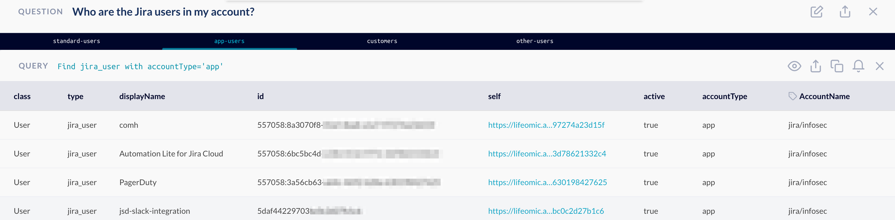

# JupiterOne 2020.45 Release

2020-05-19

## New Features

- More improvements made to the **Graph Viewer**:

    

  1. Option to lock/unlock the position of connected nodes when moving a graph node.

     > **Shift + Click** to select and move all connected nodes.

  2. Toggle between vertically-oriented and horizontally-oriented tree view.
  3. Save/download current graph view as PNG image.
  4. Action to re-center graph.
  5. Undo/Redo expand nodes action.

- UI to view **audit events** (accessible for account administrators only).

- Support **adding new and deleting policy/procedure documents** via the web
  interface in the **Policies** app.

- **Error indicator on the integrations list page** to show if one of the
  instances may require attention.

  - Also, click on the integration run status chip/bubble now goes directly to
    the jobs view for that integration instance.

- **Export/import Insight boards as JSON**, including chart configurations
  and positions. Also improved chart widgets and layouts of default dashboards.

- **Compliance Scope Filters** can be added for each compliance standard. The
  filters are applied across all compliance evidence queries mapped to that
  specific standard without the need for modifying the queries individually.
  
  > For example, a filter can be applied to limit compliance evidence queries on
  a subset of AWS accounts that are in scope for a PCI assessment instead all
  AWS accounts.

## Integrations

### Initial release of 3 new integrations (beta)

- [**Cisco AMP**](../docs/integrations/cisco-amp/index.md)
- [**Cloudflare**](../docs/integrations/cloudflare/index.md)
- [**GitLab**](../docs/integrations/gitlab/index.md)

### Updates to AWS, Azure, and other existing integrations

- Lots of updates and improvements to the 10 integrations released last sprint
  and the new integration SDK.

- **[AWS]**:

  - Added ingestion of **EFS** configurations and related query questions to
    library.
  - Added role trust relationships to both the aws_iam_saml_provider entity and
    the external SSO account entity.
  - Added role trust relationships to user/group/role using IAM identifier.
  - Fixed an issue where old role trust relationships were not properly removed.

- **[Azure]**:

  - Added ingestion of SQL Server and Database auditing status and properties.
  - Added ingestion of SQL Server alerting status and properties.
  - Added `attached` boolean and `state` property on `azure_managed_disk` entities.
  - Fixed incorrect parsing of the `targetPortRanges` (`fromPort` and `toPort`)
    of an Azure Security Group rule.
  - Fixed a bug where relationships were not created between AS groups and the
    users/members of the group.
  - Added 16 query questions and mapping to CIS Azure Foundations Benchmark.
    See <https://ask.us.jupiterone.io/filter?integrations=azure>

- **[Jira]**: Added `accountType` property to `jira_user` entities and related
  questions to query them.
  
  > For example, the question below returns Jira users by account type in tabs:
  >
  > 

- **[Github/Bitbucket]**: Added ingestion of pull requests as a
  user-configurable option.

## Improvements and Bug Fixes

- Fixed an issue with inconsistent grouping of nodes in the graph viewer.

- Fixed previous/next compliance requirement navigation.

- Policies app UI improvements.
