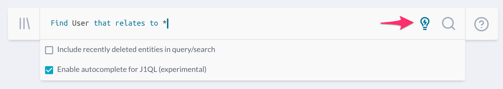

# JupiterOne 2020.48 Release

2020-06-30

## New Features

- Added **compliance status view settings** for each compliance standard object
  to toggle on/off policies, evidence, and gap analysis indicators.

  > This can be helpful when generating a PDF report to include/exclude certain
  > status indications.

- Support **On-demand Re-evaluation** of a specific compliance requirement or
  control. 
  
  > To trigger re-evaluation, click on the three-dots menu icon next to the
  > requirement/control reference ID near the top left corner.

- Users can set the **Default App** by going to **Settings (Gear Icon)** 
  and selecting **My Profile**.  The Default App is the app that will be
  launched upon login.

  > The ability for Administrators to select a Default App for a user
  > group is coming soon.

- Added dynamic display of **Pro Tips** for queries that can be improved.
  Look for the **lightbulb** icon in the query/search bar.

  

- Property panel displays `overridden` chip for any attribute value that has
  been manually modified via UI/API (i.e. different value from integration
  provider).

## Integrations

- **AWS**

  * Fixed step failures due to throttle exceptions starting tasks
  * Fixed step failures due to persister stream connect failueres
  * Fixed performance issues related to duplicate mapped relationship operations
  * Fixed password policy queries to check for undefined properties

- **Snyk**

  * Improved handling of Snyk server errors so that a failure does not
    completely prevent data ingestion

- **GitHub**

  * Integration jobs provide user feedback on invalid configuration

## Improvements and Bug Fixes

- Improved handling of entity deletion from query results. 

- Fixed an issue preventing `security_document` from being added to
  the **"Addendum and References"** section in Policies app.

- Performance improvements in the compliance requirements view when loading
  evidences, links, uploads, notes, and mapped policies/procedures.

- Improved **Add Compliance Standard** workflow to be able to import a
  standard JSON from GitHub from a list, in addition to manually import via
  Raw JSON.

- Fixed a UI caching issue when navigating compliance requirements via the 
  previous/next buttons.

- Fixed an issue with renaming a compliance standard.

- Fixed a validation bug for drag-n-drop evidence file upload in Compliance app.

- Fixed an issue where mapping a question to a compliance requirement removes
  the query names of the mapped question.

- Fixed a user group assignment issue caused by leading/trailing spaces in the
  group name.

- Several other misc UI/UX improvements and bug fixes.
