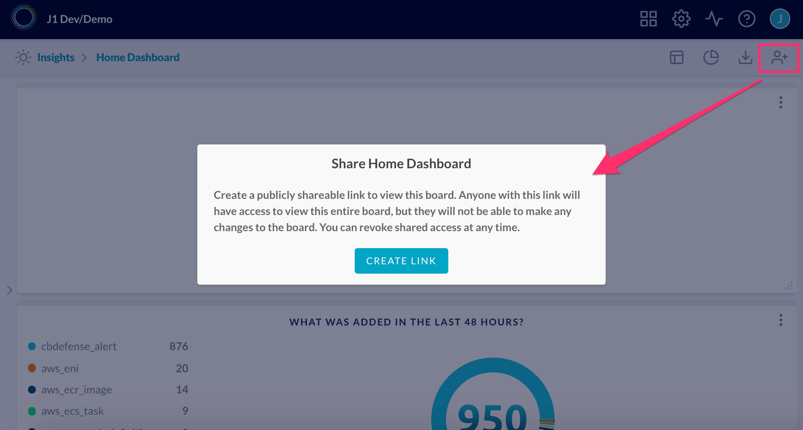

# JupiterOne 2020.56 Release

2020-10-22

## New Features

- Added support to genarate a **shareable URL for an Insights dashboard**. 

  

  > This is similar to sharing a Google Doc file via a link. This is useful for sharing with other users 
  > in the organization who do not have a JupiterOne user account, or sharing with an external user such
  > as an auditor. 
  > 
  > Anyone with acccess to the link can view the dashboard. Please share with care. Shareable link does
  > not expire, but you can revoke the link / stop sharing at any time.

- Added the ability to cancel a running query. Also, the query result actions such as sharing are enabled
  while the query is still running.

- Added **currency label** and **decimal limit** to number chart and pie chart widgets in the Insights 
  dashboard app.

- Updates to **the platform API**:

  - Added ability to fetch synchronization logs for bulk upload via API
  - Added bulk delete API

## Integrations

- Added `ONE_WEEK` polling interval as an available option to all integrations.

### AWS

- Improved queries for **"Is public access enabled for any S3 Bucket?"** to reduce false positives 
  by taking into acocunt public access block settings in addition to bucket ACL and bucket policy
- Normalize `transferLock` to `Domain.transferLock` and `Domain.locked`
- Added **CloudHSM** support: ingesting Cloud HSM `Cluster`, `Host`, and `Backup` entities 
  (each also classed as `Vault`)
- Added lifecycle properties to entities currently monitored by CloudTrail:

  * `createdBy`, `createdOn`
  * `updatedBy`, `updatedOn`
  * `deletedBy`, `deletedOn`

  > Learn more about enabling [CloudTrail Event Streaming](https://support.jupiterone.io/hc/en-us/articles/360051794213-AWS-CloudTrail-Event-Streaming) 
  > if you'd like to see entities in JupiterOne updating as changes occur in your AWS infrastructure.

### Azure

- Added `azure_event_grid_domain` entities
- Added `azure_resource_group|has|azure_event_grid_domain` relationships
- Added `azure_event_grid_domain_topic` entities
- Added `azure_event_grid_domain|has|azure_event_grid_domain_topic`
  relationships
- Added `azure_event_grid_topic` entities
- Added `azure_resource_group|has|azure_event_grid_topic` relationships
- Added `azure_event_grid_topic_subscription` entities
- Added `azure_event_grid_topic|has|azure_event_grid_topic_subscription`
  relationship
- Added `azure_event_grid_domain_topic|has|azure_event_grid_topic_subscription`
  relationship
- Added `azure_batch_account` entities
- Added `azure_resource_group|has|azure_batch_account` relationships
- Added `azure_batch_pool` entities
- Added `azure_batch_account|has|azure_batch_pool` relationships
- Added `azure_batch_application` entities
- Added `azure_batch_account|has|azure_batch_application` relationships
- Added `azure_batch_certificate` entities
- Added `azure_batch_account|has|azure_batch_certificate` relationships
- Added `azure_redis_cache` entities
- Added `azure_resource_group|has|azure_redis_cache` relationships
- Added `azure_redis_firewall_rule` entities
- Added `azure_redis_cache|has|azure_redis_firewall_rule` relationships
- Added `azure_redis_cache|connects|azure_redis_cache` relationships
- Added `azure_container_group` entities
- Added `azure_resource_group|has|azure_container_group` relationships
- Added `azure_container` entities
- Added `azure_container_group|has|azure_container` relationships
- Added `azure_container_volume` entities
- Added `azure_container_group|has|azure_container_volume` relationships
- Added `azure_container|uses|azure_container_volume` relationships
- Added `azure_container_volume|uses|azure_storage_file_share` relationships
- Added `azure_advisor_recommendation` entities
- Added `ANY_SCOPE|has|azure_advisor_recommendation` relationships. These can
  target any scoped entity within Azure.
- Added `azure_security_assessment` entities
- Added `azure_security_assessment|identified|azure_advisor_recommendation`
  relationships
- Added `azure_subscription|performed|azure_security_assessment` relationships

### GoDaddy

- Normalize `transferProtected` to `Domain.transferLock` and `Domain.locked`

### Google Cloud

- Expose boolean `public` property on `google_storage_bucket` that determines
  whether a storage bucket is public
- Added CIS Benchmarks for Google Cloud managed questions:
  * Ensure that corporate login credentials are used
  * Ensure that there are only GCP-managed service account keys for each service account
  * Ensure that Service Account has no Admin privileges
  * Ensure that IAM users are not assigned the Service Account User or Service Account Token Creator roles at project level
  * Ensure user-managed/external keys for service accounts are rotated every 90 days or less
  * Ensure encryption keys are rotated within a period of 365 days
  * Ensure that the default network does not exist in a project
  * Ensure that SSH access is restricted from the internet
  * Ensure that RDP access is restricted from the Internet
  * Ensure that Google Cloud Compute instances are not configured to use the default service account
  * Ensure that Cloud Storage bucket is not anonymously or publicly accessible
  * Ensure that Cloud Storage buckets have uniform bucket-level access enabled

### Google Workspaces

- Added `google_token - ALLOWS -> Vendor` relationships

### Qualys

- Integration ported to latest SDK, executing across multiple steps, significant improvements on performance and scalability
- Updated entity/relationship ingestion to better match the latest 
  [JupiterOne Data Model for Vulnerability Management](https://support.jupiterone.io/hc/en-us/articles/360041429733-Data-Model-for-Vulnerability-Management)
- Improved API client to handle rate limit response headers
- Ingest `Account` entity and relate to `Service` entities for VMDR and Web Application Scanner, with portal/service version information in raw data
- Ingest `Service - SCANS -> Host` relationships and `Service - IDENTIFIED -> Finding` relationships

## Other Improvements and Bug Fixes

- Fixed UI issue with status indicators not lining up with compliance titles.

- Resolved an issue with cache token expiration that might require the user to refresh the page while still logged in to the app.

- Fixed 502 errors that were happening on Lambda cold start due to gremlin package bug.

- Improved scalabiility of the synchronization process.
