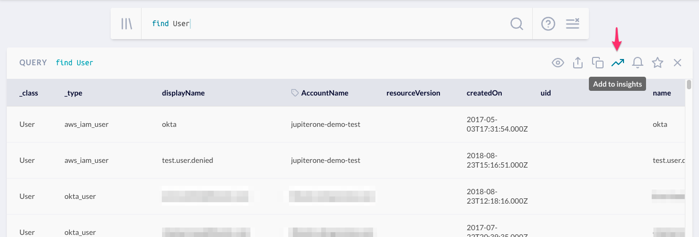

# JupiterOne 2020.57 Release

2020-11-03

## New Features

- Updated **Table widget in Insights** app to match the styling of query results table from Landing.

- Added new **Graph widget in Insights** app. 

- Added the ability to add a query result (either table or graph view) to an Insights dashboard directly
  from the Landing page.

  

- Added a visual indicator -- `public` chip -- to Insights dashboards that have been shared via a link.

- New **compliance review workflow** feature is released in beta! 

  > Contact us if you would like to participate in the beta program.

- Added support for **per record action** in alert rules (beta).

  > Contact us if you would like to participate in the beta.

- Added support to **tag an S3 bucket** as an alert rule action. This must be configured via the Advanced
  Rule Editor.

## Integrations

### Airwatch

- Fixed error creating device `User` entity & relationship when the device does not have an associated user
- Fixed error creating duplicate device `User`

### Azure

- Added `loggingEnabled` property on database entities
- Added `azure_policy_assignment` entities
- Added `ANY_SCOPE|has|azure_policy_assignment` relationships
- Improved error handling and reporting
​
> With Azure policy assignments ingested, Azure CIS Benchmarks 2.3 - 2.15 will
> soon be added as managed queries and mapped in the Compliance app.
​​
### Cloudflare

- Changed `cloudflare_account_role|assigned|member` to `cloudflare_account_member|assigned|role`

### Detectify

- Improved handling of some Detectify API errors
- Split work of fetching scans and reports to improve error handling

### Gitlab

- Deduplicate `gitlab_project_has_user` relationships
​
### Google Workspaces

- Google user `department`, `division`, `location` properties are now transferred to the `Person` entity

### Okta

- Okta user `department`, `division` properties are now transferred to the `Person` entity

### SentinelOne

- Agent to `Device` entity relationship mapping now supports matching by `computerName -> hostname`, `displayName -> displayName`

### Slack

- Updated rate limit settings to better handle larger accounts
- Updated docs to include note about private Slack channel message delivery
- Added `active` property to `slack_user`

## Other Improvements and Bug Fixes

- Performance improvements of integration jobs
- Fixed an issue where adding a period in a string field for a property would cause unexpected behavior
- Fixed an issue where creating a tag in the UI would create two tags
- Fixed issues related to currency formatting in Insights widgets
- Fixed an issue where Jira Collector was not allowing users to input data
- Fixed an issue where Vulnerabilities marked as an Exception were not showing up in the “Show Exceptions” view
- Fixed an issue where clicking a Vulnerability redirected the user to the Alerts page
