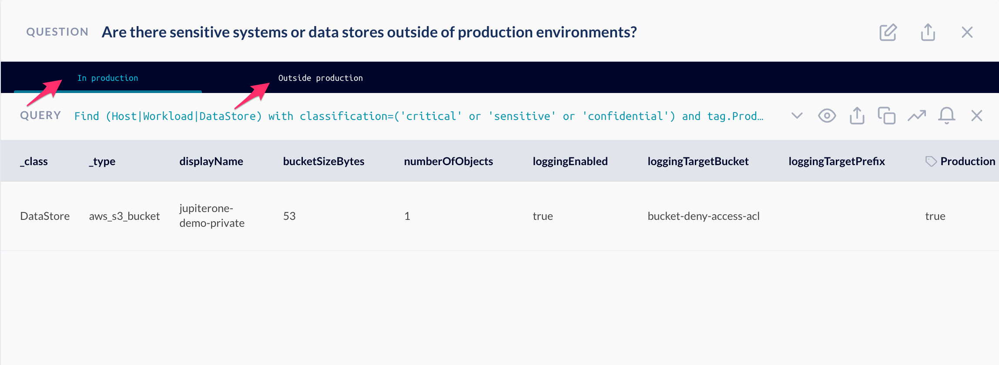
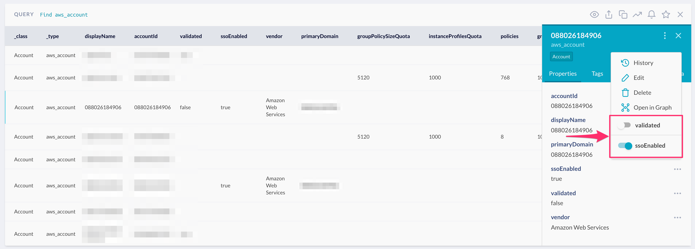

# JupiterOne 2021.62 Release

2021-01-13

_Our first sprint in 2021!_

## New Features

- New **optional relationship traversal** feature added to J1QL! 

  Here's an example showing the syntax with the optional relationship wrapped in
  `()?`:

  ```j1ql
  Find User (that assigned AccessRole)?
    that assigned AccessPolicy
    that allows as permission *
  where permission.admin=true
  return TREE
  ```

  The example above searches for Users that are directly assigned an
  AccessPolicy granting admin permissions to certain resources, or via an
  AccessRole assigned to the User.

  > Note that this is a beta feature and the syntax for describing optional
  > traversals may change in the future to help improve clarity. 
  > 
  > For full documentation, please see the **Optional traversals** section in the
  > [JupiterOne Query Language doc](../docs/jupiterone-query-language.md).

- Another significant query performance improvement for all types of queries
  (including aggregate queries, queries with negations, and optional
  traversals).

- Added _Cursor_ support for J1QL queries via the API. 

  See details in the **Querying the graph with J1QL** section of the 
  [Platform API Doc](../docs/jupiterone-api.md).

- **Visual Query Builder** now supports

  * **Aggregate** returns (i.e. `COUNT`, `SUM`, `MAX`, `MIN`, `AVG` functions)
  * **Grouping** returns by an attribute value
  * Allowing filter values to be selected as `undefined`

- Added the ability to **assign compliance review owners at the standard level**.

  Also in Compliance Review editing, the user assignment dropdown shown in the
  modal now shows names, avatars, and emails to more easily identify user
  accounts.

- Added `resultsAre` field to J1QL questions. This field will be used for
  questions mapped to compliance requirements to perform gap analysis, instead
  of using the `name` of each query as the key. This allows each query in a
  question to have a more descriptive name.

  _Here's a screenshot of the edit question modal:_

  

  _See tabs with names in the screenshot below:_

  

  > Note: this change is backwards compatible to any existing question with queries
  > named `good`, `bad`, or `unknown`. These questions/queries will continue to
  > work for compliance gap analysis. Pre-packaged questions have been updated with
  > `resultsAre` field and more descriptive query names.
  > 
  > See [this doc](../guides/compliance/compliance-gap-analysis.md) for details
  > on how the compliance gap analysis is calculated.

- Added quick toggles for boolean properties in the entity property panel.

  

## Integrations

### Azure

- Diagnostic Settings entities and relationships for Network Security Groups
- Diagnostic Settings entities and relationships for Activity Logs (Azure Subscription)
- Improved Azure API error handling to better report failures to users

### Google Cloud

- Improved Google API error handling to better report failures to users

### Google Workspaces

- Improved Google API error handling to better report failures to users

### Malwarebytes <i class="fas fa-asterisk"></i>

- Initial release of Malwarebytes integration (beta)! 🎉

  Check out the [docs](https://github.com/JupiterOne/graph-malwarebytes/blob/master/docs/jupiterone.md) 
  for details on what's currently supported.

### Qualys

- Duplicate values in Finding.targets are removed
- Fixed memory leak impacting long running instances
- Advanced the mock Qualys server to facilitate load testing
- Handling invalid `DETECTION.QID` values such as `'{"#text":"o��t�","��\u001dX���,</QID'`
- Fixed bug in detecting concurrency limit exceeded Qualys API response
- Fixed bug in concurrency calculation that allowed too many active requests
- Disabled the `RESULTS` field from the Qualys host detections response to save time and memory (data was unused)

### Rapid7

- Drastically improved developer environment setup for Rapid7 Nexpose Security Console

## Community Projects

- Created a new repository of **Insights dashboard templates**. Check them out at:

  <https://github.com/JupiterOne/insights-dashboards>

  PRs for Swags!

## Other Improvements and Bug Fixes

- Asset inventory now has a max width for columns so long text items don’t make a row extra long

- Experimental Auto Mapping button for a compliance standard has been removed --
  we plan to bring this feature back in the near future

- Fixed an issue that may cause the Compliance app to trigger an infinite load screen

- Fixed an issue where a user could not update the audit tracking field for a compliance item via the UI

- Fixed an issue where the graph view would refresh if an entity was moved

- Added sorting to the rule table in the alerts app

- Compliance reviews can now be fully deleted

- Fixed an issue with resizing the window while viewing a compliance standard

- Increase performance with loading compliance settings menu
