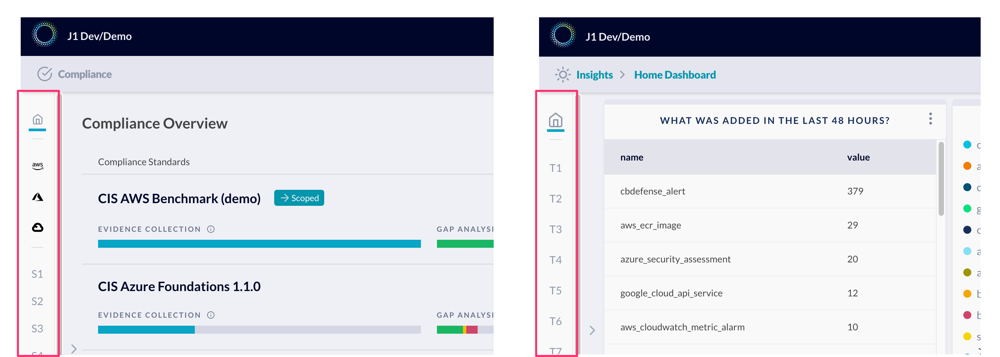

# JupiterOne 2021.63 Release

2021-01-27

_Lots of focus on bug fixes this sprint._

## New Features

- Added new **collapsed state** to the menu/navigation panel on the left side of
  the **Insights** and **Compliance** apps. This provides clearer visual of the
  additional dashboards, benchmarks, compliance standards, and security
  questionnaires that are available in the app.

  

- Improved query results UI so that they now use more of the available white
  space on the page

## Integrations

### Integrations SDK

- Fixed `DuplicateKeyTracker` to support millions of keys
- Fixed CLI execution to support an integration configuration that skips writing to disk (advanced feature)
- Integration configuration values have whitespace trimmed to avoid surprising errors

### AWS

- Substantially reduced memory usage in ECR step to avoid crashing integration execution for large numbers of findings
- Fixed some error handling that obscured root cause messages

### Google Workspaces

- Added `--skip-project-id [projectId]` option to `jupiterone-organization-setup` script

### Qualys

- Fetching knowledge base vulnerabilities using concurrency headers from Qualys server responses
- Mock Qualys server enforces concurrency limits in vulnerabilities endpoint
- Mock Qualys server answers vulnerabilities that have CVEs and some that don't
- Enable ingestion of Finding - IS -> Vulnerability mapped relationships
- Fixed bug in QID -> finding key tracking that kept the program from associating all findings to their vulnerabilities

### Snipe-IT

- Added `Device.email` to support mapping to `Person` entities

## Other Improvements and Bug Fixes

- Fixed an issue with editing compliance reviews when an assigned user no longer existed in the organization
- Fixed an issue where CSV download of assets would fail
- Fixed an issue where "Find related" / "Find similar" action from an entity property would navigate users to /home instead of /landing
- Fixed an issue where compliance/policy mappings were not able to be viewed or edited
- Fixed an issue where "Users & Access" would crash under certain circumstances
- Fixed an issue where uploading a JSON file to import Insights dashboards would fail
- Fixed an issue where the `updatedOn` field was not properly updating for policies and procedures in the graph
- Fixed an issue where sorting by severity in the Alerts app would cause a crash
- Fixed an issue where compliance questionnaire items could not be answered or edited
- Fixed an issue where compliance items could not be marked as “Not applicable”
- Fixed an issue where policy document links would open a new tab instead of navigating to the relevant policy document in the app
- Fixed an issue where updating policy/procedure metadata could cause potential metadata loss
- Fixed an issue where inventory table rows would grow in size to be too large when a large amount of text was provided
- Fixed an issue where alert rule icons size was skewed
- Fixed an issue to remove trailing slashes on the end of the URL for certain app routes
- Fixed an issue where non admin users could see a 400 error when running a query
