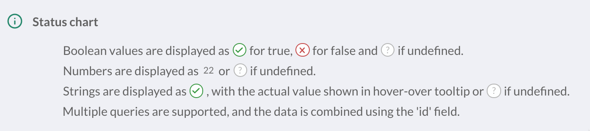
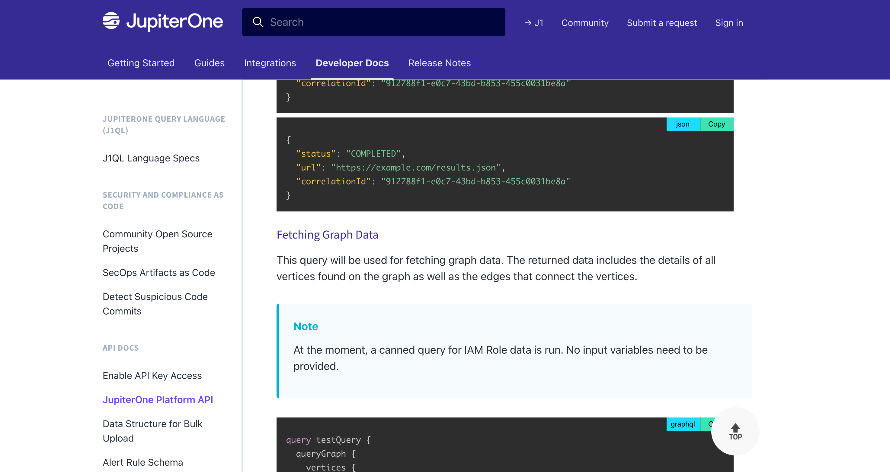

# JupiterOne 2021.71 Release

2021-05-19

## New Features and Improvements

- Added **full text search to Policies** - you can now easily search all
  policies and procedures for specific keywords.

- Added support to **export a single policy in PDF**.

- All existing SOC 2 frameworks have been updated so they can now be managed
  from the UI rather than requiring users to edit the JSON file, leveraging the
  new controls editing feature.

- Added a new **"Status" widget** to the Insights app - this allows you to
  create a summarized "status" of a given class of entities (such as Person or
  Host) and certain properties (properties are shown with appropriate indicator
  icons).

  

- Revamped products / in-app purchase page.

- In Alerts -> Vulnerability Findings view, **normalized "Severity"** and other
  fields when filtering findings (users no longer need to select "Low", "LOW",
  and "low" in order to search for all findings with a low severity, instead
  there is just now a single "Low" to select).

- Navigating to `/inventory` will now also take you to the asset inventory page
  (previously only `/assets` would)

- Added a logout button to the onboarding flow so users can still switch
  user accounts if needed

- Fully redesigned [documentation](https://support.jupiterone.io) site - much
  more developer friendly 🎉 

  

## Integrations

### AWS 

- Handle authorization and Not Found responses in `cloudhsmv2.listTags`,
  `cloudhsmv2.describeClusters`, and `cloudhsmv2.describeBackups` to avoid
  step failures.

- Fix Macie step failure when the service is not enabled.

- Fix failure to use role chaining when `useRoleChaining` is set up in an
  integration instance.

- Continued rollout of AWS `accountId` property on entities.

- Added support for VPC Endpoints -- `aws_vpc_endpoint` entities -- as well as
  parsing of the VPC Endpoint policies to create corresponding permissions
  relationships.

### Azure

- Added support for ingesting the following **new** resources:

  | Service         | Resource / Entity        |
  | --------------- | ------------------------ |
  | Network         | `azure_private_endpoint` |
  | App Service     | `azure_web_app`          |
  | App Service     | `azure_function_app`     |
  | App Service     | `azure_app_service_plan` |
  | Policy Insights | `azure_policy_state`     |

- Added support for ingesting the following **new** relationships:

  | Source                    | \_class    | Target                   |
  | ------------------------- | ---------- | ------------------------ |
  | `azure_resource_group`    | `HAS`      | `azure_private_endpoint` |
  | `azure_subnet`            | `HAS`      | `azure_private_endpoint` |
  | `azure_private_endpoint`  | `USES`     | `azure_nic`              |
  | `azure_private_endpoint`  | `CONNECTS` | `ANY_RESOURCE`           |
  | `azure_resource_group`    | `HAS`      | `azure_web_app`          |
  | `azure_resource_group`    | `HAS`      | `azure_function_app`     |
  | `azure_resource_group`    | `HAS`      | `azure_app_service_plan` |
  | `azure_web_app`           | `USES`     | `azure_app_service_plan` |
  | `azure_function_app`      | `USES`     | `azure_app_service_plan` |
  | `azure_policy_assignment` | `HAS`      | `azure_policy_state`     |
  | `azure_policy_definition` | `DEFINES`  | `azure_policy_state`     |
  | `ANY_RESOURCE`            | `HAS`      | `azure_policy_state`     |

- Added the following property to `azure_storage_account`:

  - `networkRuleSet.allowedIpAddresses`

- Changed the following property values on `azure_storage_account`:

  | Previous property name        | New property name              |
  | ----------------------------- | ------------------------------ |
  | `networkRuleSetDefaultAction` | `networkRuleSet.defaultAction` |
  | `networkRuleSetBypass`        | `networkRuleSet.bypass`        |

- Renamed type `azure_network_azure_firewall` to `azure_network_firewall`

### GitHub

- Fix GitHub App installation flow failure.

### Google Cloud

- [#152](https://github.com/JupiterOne/graph-google-cloud/issues/152) - Publish
  job log message when `compute.images.get` permission is missing

- [#153](https://github.com/JupiterOne/graph-google-cloud/issues/153) - Handle
  disks that do not have an image assigned (blank disks)

- [#140](https://github.com/JupiterOne/graph-google-cloud/issues/140) - Map more
  IAM permissions to service APIs, which will generate additional
  `google_cloud_api_service` **HAS** `google_iam_role` relationships

- New properties added to resources:

  | Entity                     | Properties          |
  | -------------------------- | ------------------- |
  | `google_compute_instance`  | `webLink`           |
  | `google_compute_disk`      | `webLink`           |
  | `google_cloud_api_service` | `hasIamPermissions` |
  | `google_iam_role`          | `readonly`          |
  |                            | `permissions`       |

- Added support for ingesting the following **new** resources:

  | Service         | Resource / Entity        |
  | --------------- | ------------------------ |
  | Compute         | `google_compute_image`   |

- Added support for ingesting the following **new** relationships:

  | Source                     | \_class    | Target            |
  | -------------------------- | ---------- | ----------------- |
  | `google_group`             | `ASSIGNED` | `google_iam_role` |
  | `google_cloud_api_service` | `HAS`      | `google_iam_role` |

- `google_user` is now created as a target entity through a mapped relationship
  to avoid duplicating information ingested by the Google Workspace integration.

### HackerOne

- Improved description and help text for the configuration unique program ID.

### Jira

- Validate `projects` configuration value to help users resolve errors.

- Add support for ingesting all Jira custom field types.

### OneLogin

- Added `onelogin_user.custom_attributes.*` to ingest any/all defined custom
  attributes for onelogin users.

### Slack

- Fix configuration editing flow to prevent unnecessarily re-authorizing the
  Slack App when changing configuration properties that do not require
  re-authorization.

### SonarQube

- Initial release of SonarQube integration (beta)! 🎉 Check out the
[docs](https://github.com/JupiterOne/graph-sonarqube/blob/master/docs/jupiterone.md)
for details on what's currently supported.

### Tenable Cloud

- Handle `500` response fetching asset vulnerability details from Tenable
  (vulnerabilities for the asset are not ingested).

- Handle `404` response fetching host details for archived scans.

- Tenable client now correctly resets the retryDelay so that other status codes
  don't end up using the calculated retry delay from a `429` status code.
  
- Migrate to Tenable bulk export API endpoints for vulnerabilities and assets.

## Bug Fixes
 
- Resolved an issue where the Finding Details viewer would not have a max height
  and would cause large amounts of scrolling to be required

- Resolved some issues regarding importing rule packs after configuring your
  first integration

