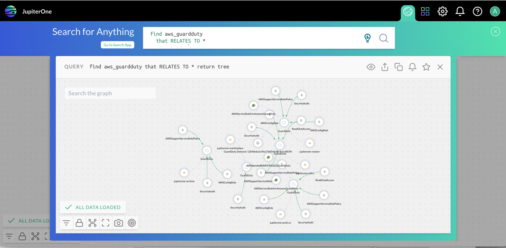

# JupiterOne 2021.77 Release

August 11, 2021

## New Features and Improvements

- New **Query Anywhere** feature that allows users to quickly access the query 
  interface from any page in the product and get answers to their questions without 
  switching contexts.
  
  

- Added new **string concatenation** function to J1QL. The new J1QL 
  return function `CONCAT()` allows users to combine two or more queried 
  columns, strings, or numbers into one new string value. 
  
  For example: 
  
  ```j1ql
  Find Person 
  Return CONCAT(Person.lastName, ', ', Person.firstName)
  ```

- Added **CIS AWS Benchmark v1.4** to the Compliance app. Customers who configure 
  an AWS integration for the first time will have v1.4 auto imported (was previously v1.2).

- Added a new **Request a feature** option in the JupiterOne help center dropdown menu,
  located above the **Report a bug** option.

- Improved styling to the Policies app.

## Integrations

### Artifactory

- Provided `404` error handling to validate configuration and display a useful error message
  to the user.

- Changed `CodeRepo.{id, createdBy, updatedBy}` from `number` to `string` to
  meet data-model schema requirements.

### Azure

- Improved configuration validation when a `subscriptionId` parameter is provided
  to present better errors to users, such as:

  - `The provided subscription identifier '{{SUBSCRIPTION_ID}}' is malformed or invalid.`
  
  - `The subscription '{{SUBSCRIPTION_ID}}' could not be found.`

  - `The client '{{CLIENT_ID}}' with object id '{{CLIENT_ID}}' does not have authorization to perform action 'Microsoft.Resources/subscriptions/read' over scope '/subscriptions/{{SUBSCRIPTION_ID}}' or the scope is invalid.`

### AWS

- Added support to capture EC2 user data as a property and detect secrets in the
  user data. Secrets (such as API token, access key, hash) detected are redacted
  and the EC2 instance entity is set with the `hasSecrets: true` property.

  > Note: this requires `ec2:describeInstanceAttribute` permission.

- Added `aws_redshift_cluster_parameter_group` entities and relationships to
  `aws_redshift_cluster` entities.

### Crowdstrike

- API requests that respond with a `500` status code are now retried.

- Normalized `macAddress` to support mapping to `Host` entities.

- New properties added to resources:

  | Entity               | Properties       |
  | -------------------- | ---------------- |
  | `crowdstrike_sensor` | `ec2InstanceArn` |

### Google Cloud

- API calls are now retried on "Quota exceeded" errors

- Encoded the path part of the `webLink` entity property

- Added support for ingesting the following **new** relationships:

  | Source               | class        | Target                           |
  | -------------------- | ------------ | -------------------------------- |
  | `google_iam_binding` | **ALLOWS**   | `ANY_RESOURCE` (\*)              |
  | `google_iam_binding` | **ALLOWS**   | `google_cloud_projects`          |
  | `google_iam_binding` | **ALLOWS**   | `google_sql_mysql_instance`      |
  | `google_iam_binding` | **ALLOWS**   | `google_sql_postgres_instance`   |
  | `google_iam_binding` | **ALLOWS**   | `google_sql_sql_server_instance` |
  | `google_iam_binding` | **ASSIGNED** | `google_domain`                  |

  \* other than specific ingested types

### Google Workspaces

- Provided `404` error handling for invalid email responses for the group settings endpoint.

### OneLogin

- Added the ability to pass a different API hostname (such as
  `https://api.eu.onelogin.com`) to fetch data from different OneLogin
  environments.

- Fixed `undefined undefined` in user jobs to show proper `status` and
  `statusText`, such as `401 Unauthorized`.

- Fixed `UPLOAD_ERROR`, `NOT_ALLOWED` caused by `_icon` property on app and
  personal app entities. Removed the `_icon` property as it is not allowed to be
  an underscore property.

- Migrated to the latest SDK, leading to normalized property names due to schema
  validations:

  - `login_id` -> `loginId`
  - `connector_id` -> `connectorId`
  - `custom_attribute` prefix -> `customAttribute`

### Okta

- Provided `404` error handling for non-existent groups or apps when fetching details.

## Bug Fixes
 
- Resolved an issue where fields including the word `tag` showed the tag icon in the column header.

- Resolved an issue where the recurring review on a compliance requirement did not send a reminder when the review was almost due.

- Resolved an issue that occurred where the modal was not cleared between evidence uploads.

## Coming Soon!

- Update to Query Language following De Morgan's Law:

  To maintain language correctness, J1QL will fulfill shorthand filters in accordance 
  with De Morgan's Law. This improvement only impacts queries that use the 
  operators `!=`, `!~=`, `!^=`, `!$=` when operating on a group of values.
  
  For example, 
   
  ```j1ql
  FIND jira_user WITH accountType != ('atlassian' OR 'app' OR 'customer')
  ```

  is the equivalent of

  ```j1ql
  FIND jira_user WITH 
    accountType != 'atlassian' AND 
    accountType !=  'app' AND 
    accountType !=  'customer'
  ```
   
  In other words, J1QL will interpret the above query to return all jira_user entities, 
  excluding those that have an accountType value of 'atlassian' or 'app' or 'customer'. 
   
  !!! warning
      **This is a breaking change!** We are taking precautions to ensure 
      saved questions and queries are not inadvertently effected. 
      
      We will run maintenance jobs to update all saved queries in questions, 
      alerts, and Insights dashboard widgets during the rollout of this change.
      You do _not_ have to make those changes manually.
      
      However, if you have stored queries outside of your JupiterOne account 
      (e.g. in a custom script), please update those queries accordingly. 
   
  !!! note
      This change is planned to be rolled out on **Wednesday, Aug 24, 2021**.
