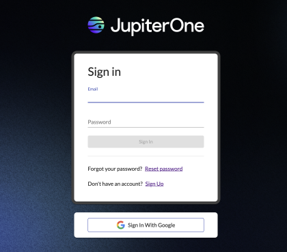
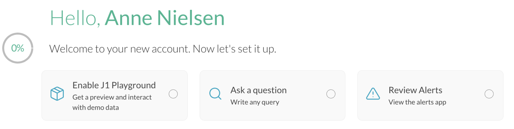
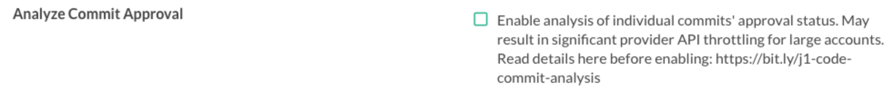
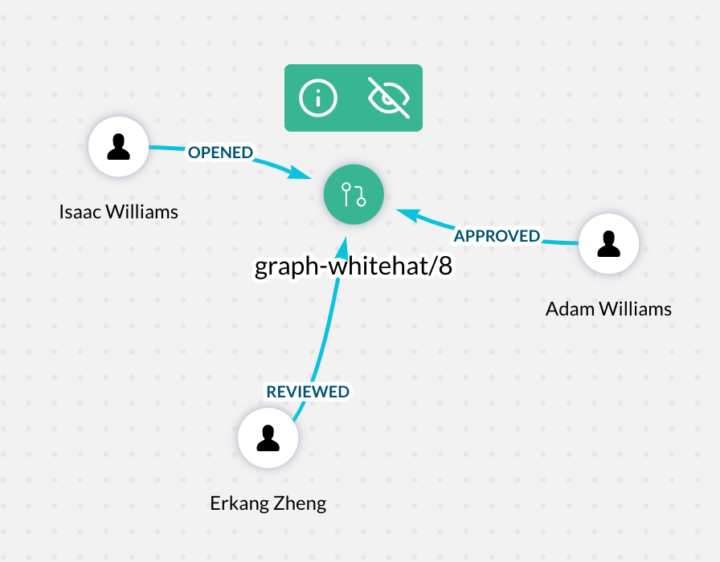

# JupiterOne 2021.81 Release

October 14, 2021

## AWS Integration Enhancements

J1 recently discovered some ineffective relationships were being created between the `google_iam_role` and several entities which may be causing incorrect permissions to be reported in queries.

In order to correct this, a `google_iam_binding` entity has been added to the Google Cloud integration that better represents how permissions are associated with principals in Google Cloud.

### What has changed?

- Added support for ingesting the following new entity:

| Resource           | Entity `_type`       | Entity `_class` |
| ------------------ | -------------------- | --------------- |
| IAM Binding        | `google_iam_binding` | `AccessPolicy` |

- Added support for ingesting the following new relationships:

| Source Entity `_type`      | Relationship `_class` | Target Entity `_type`               |
| -------------------------- | --------------------- | ----------------------------------- |
| `google_iam_binding`       | **ASSIGNED**          | `google_iam_service_account`        |
| `google_iam_binding`       | **ASSIGNED**          | `google_user`                       |
| `google_iam_binding`       | **ASSIGNED**          | `google_group`                      |
| `google_iam_binding`       | **ASSIGNED**          | `google_domain`                     |
| `google_iam_binding`       | **ASSIGNED**          | `google_iam_role`                   |
| `google_iam_binding`       | **ASSIGNED**          | `everyone`                          |
| `google_iam_binding`       | **ASSIGNED**          | `google_cloud_authenticated_users`  |
| `google_iam_binding`       | **USES**              | `google_iam_role`                   |
| `google_iam_binding`       | **ALLOWS**            | `ANY_RESOURCE`                      |
| `google_cloud_api_service` | **HAS**               | `ANY_RESOURCE`                      |

- Removed the following relationships:

| Source Entity `_type`              | Relationship `_class` | Target Entity `_type`  |
| ---------------------------------- | --------------------- | ---------------------- |
| `google_user`                      | **ASSIGNED**          | `google_iam_role`      |
| `google_group`                     | **ASSIGNED**          | `google_iam_role`      |
| `google_domain`                    | **ASSIGNED**          | `google_iam_role`      |
| `everyone`                         | **ASSIGNED**          | `google_iam_role`      |
| `google_cloud_authenticated_users` | **ASSIGNED**          | `google_iam_role`      |
| `google_iam_service_account`       | **ASSIGNED**          | `google_iam_role`      |

- `google_iam_binding` ingestion will take place in the `fetch-iam-bindings` step instead of the `fetch-resource-manager-iam-policy` step, which has been removed. If an integration does not use the configure organization projects option in the configuration, this step will use the project scope to fetch IAM policies.

### Customer Impact

As a result of these change customers should be aware of the following:

- For the integration to properly ingest the IAM bindings the Cloud Asset API (cloudasset.googleapis.com) needs to be enabled in your Google Cloud account.  If this API is not enabled, the step that imports the IAM bindings will be skipped during ingestion. For additional details on enabling the Cloud Asset API see the [J1 Documentation](https://github.com/JupiterOne/graph-google-cloud/blob/main/docs/jupiterone.md#in-google-cloud) and the [Google Cloud Documentation](https://console.cloud.google.com/apis/library/cloudasset.googleapis.com).

- Traversal queries in J1 that previously queried a relationship directly between the `google_iam_role` and the principal member of your Google account will need to go through the `google_iam_binding_entity`. For example, `Find google_user ASSIGNED google_iam_role` will need to be changed to `Find google_user that ASSIGNED google_iam_binding that USES google_iam_role`.

- The following queries in the question library have been updated based on these changes:
  - “Ensure that IAM users are not assigned the Service Account User or Service Account Token Creator roles at project level"
  - “Ensure that Service Account has no Admin privileges”

### Additional Information

- There is a new [blog post](https://try.jupiterone.com/blog/google-cloud-storage-access-analysis) from J1 Engineering that goes in to more detail about these changes.

- The code for the changes is available in the public repo on GitHub, along with the changelog file:
  - Repo: https://github.com/JupiterOne/graph-google-cloud
  - Changelog: https://github.com/JupiterOne/graph-google-cloud/blob/main/CHANGELOG.md

October 5, 2021

## Announcements

J1 will be deploying an updated login experience in the next few weeks - stay tuned!

## New Features and Improvements

- Delivered a refreshed landing page for querying your data.

- Delivered a new onboarding to-do list for new J1 users to get oriented and obtain 
  value faster.

- You can now perform bulk uploads of data in the Assets App without a file size limit. 
  Note: you must have Assets Admin and GraphViewer Admin to perform a bulk upload.

## Integrations

### AWS

- Fixed validation error when supplying empty array to `macie2.getFindings` API.

- Added `cluster` parameter to `describeContainerInstances` to address AWS 
  notice of validation changes that began on September 24, 2021.

- Added support for ingesting the following additional properties on `aws_instance` entities:
  - `metadataOptionsState`, `httpTokens`, `httpPutResponseHopLimit`, `httpEndpointEnabled`, 
    `enclaveOptionsEnabled`, `hibernationOptionsConfigured`.

### Azure

- Improved handling of errors caused by disabled Azure accounts.

- Improved handling of some errors to better communicate the cause of the error.

### Cloudflare

- Migrated the integration to the latest SDK and infrastructure to allow 
  extended execution time on very large accounts.

- Improved handling and reporting of authentication and authorization errors to users.

### GitHub

- With this update, J1 has requested read-only access to Github Organization Secrets, 
  Github Repository Secrets, and environment secrets metadata, which must be granted 
  in the JupiterOne app in Github. 
  
  Read-only access allows J1 to access information about the secrets, but not the 
  encrypted values. J1 has no access to the values of secrets at any time, 
  nor will J1 request such access.
  
  This access enables you to ask questions in J1 about your secrets, such as 
  "What Secrets are older than 365 days?" or "Which Repos have access to Org Secrets?" or 
  "Are there instances where Repo Secrets override Org Secrets of the same name?"
  
  For more information on GitHub Secrets, review the GitHub documentation 
  about the controls in place with this access:
  
  - Secrets: https://docs.github.com/en/rest/reference/actions#secrets

  - Get an organization secret: https://docs.github.com/en/rest/reference/actions#get-an-organization-secret

  - Get a repository secret: https://docs.github.com/en/rest/reference/actions#get-a-repository-secret
  
  - Get an environment secret: https://docs.github.com/en/rest/reference/actions#get-an-environment-secret 
  
  If existing GitHub integration users do not grant these additional permissions 
  in their GitHub account, J1 automatically omits these steps in the integration and 
  does not import the organization and repository secret entities and properties. The rest 
  of the data for already approved permissions continue to be imported into J1 as expected.  
  
  New users of the GitHub integration in J1 are required to approve these permissions 
  to use the integration.
  
- Added support for ingesting the following new entities:

| Resources          | Entity `_type`       | Entity `_class` |
| ------------------ | -------------------- | --------------- |
| GitHub Environment | `github_environment` | `Configuration` |
| GitHub Env Secret  | `github_env_secret`  | `Secret`        |

- Added support for ingesting the following new relationships:

| Source Entity `_type` | Relationship `_class` | Target Entity `_type` |
| --------------------- | --------------------- | --------------------- |
| `github_repo`         | **HAS**               | `github_environment`  |
| `github_environment`  | **HAS**               | `github_env_secret`   |
| `github_env_secret`   | **OVERRIDES**         | `github_org_secret`   |
| `github_env_secret`   | **OVERRIDES**         | `github_repo_secret`  |
| `github_repo`         | **USES**              | `github_env_secret`   |

- Added support for ingesting the following additional properties on `github_account` entities:
  - `createdOn`, `updatedOn`, `description`, `email`, `node`, `databaseId`, `isVerified`, `location`, `websiteUrl`, `webLink`

- Added support for ingesting the following additional properties on `github_team` entities:
  - `createdOn`, `updatedOn`, `databaseId`, `description`, `node`, `privacy`

- Added support for ingesting the following additional properties on `github_user` entities:
  - `company`, `createdOn`, `updatedOn`, `databaseId`, `node`, `isEmployee`, `location`, `websiteUrl`, `email`

- Added support for ingesting the following additional properties on `github_repo` entities:
  - `autoMergeAllowed`, `databaseId`, `deleteBranchOnMerge`, `description`, `homepageUrl`, `node`, `isDisabled`, 
    `isEmpty`, `isFork`, `isInOrganization`, `isLocked`, `isMirror`, `isSecurityPolicyEnabled`, `isTemplate`, 
    `isUserConfigurationRepository`, `lockReason`, `mergeCommitAllowed`, `pushedOn`, `rebaseMergeAllowed`

- Added support for ingesting the following additional properties on `github_pullrequest` entities:
  - `databaseId`, `node`, `commitsCount`, `approvalsCount`, `approvalLastAt`

- Pull requests that are opened, reviewed, or approved by a user who is not part of the
  current organization or collaborator list now have a mapped relationship to a
  GitHub user with the login recorded in the pull request properties.

- Fixed `createdOn` and `updatedOn` properties on `github_org_secret`, `github_repo_secret`, and `github_app` to be Unix timestamp integers.

- Fixed step failures caused by insufficient permissions (disallowed scopes).

#### GitHub Analyze Commit Approval Changes

The initial version of the J1 GitHub integration provided a configuration option to enable analyze commit approvals. This feature gives you 
the ability to see which users have opened, reviewed, and/or approved a pull request in their GitHub account.

 

 The `analyzeCommitApproval` step in the integration generates the following relationships in the graph:

  | Source Entity `_type` | Relationship `_class` | Target Entity `_type` |
  | --------------------- | --------------------- | --------------------- |
  | `github_user`         | **OPENED**            | `github_pullrequest`    |
  | `github_user`         | **REVIEWED**          | `github_pullrequest`    |
  | `github_user`         | **APPROVED**          | `github_pullrequest`    |

  These entities appear in the graph, showing which users opened, reviewed, and/or approved a pull request in GitHub:

  

Initially, this feaure was an optional setting because in large GitHub accounts it could result in API throttling for 
a GitHub account. J1 has recently made updates to include this information as part of the data imported to J1, with no 
adverse effect on your API usage. Because of this improvement to the integration, this data is now included in all 
GitHub integrations, regardless of the setting in the configuration UI. A future update will remove this setting from the UI.

 **Customer Impact**

If you had already enabled this setting in your GitHub configurations, it continues to behave the same after J1 updates the UI.

If you did not enable this setting due to API throttling concerns, you now have additional GitHub data available in your 
J1 account with no adverse effect on your GitHub API usage. 

The option to ingest pull requests also exists in the J1 Bitbucket integration, however, there is no change in its behavior. 
It is still an option that you can choose to enable or not.

### Google Cloud

- Fixed `UNABLE_TO_FIND_PROJECT_ID` error.

- Moved J1-managed questions into the [open source `graph-google-cloud`](https://github.com/JupiterOne/graph-google-cloud/tree/main/jupiterone/questions) project.
  You are welcome to create pull requests!

- Fixed missing `Internet` **ALLOWS** `google_compute_firewall` relationships for
  `0.0.0.0/0`/`::/0` source CIDR blocks.

### Google Workspaces

_**ACTION REQUIRED**_

Log in to the Google Workspace **Admin Console** as a super administrator and:

1. Click **Security** > **API controls**.
2. In the **Domain wide delegation** pane, select **Manage Domain Wide
   Delegation**.
3. Click **Edit** near the JupiterOne Service Account and add additional entries
   under **API scopes**:
   - `https://www.googleapis.com/auth/admin.directory.rolemanagement.readonly`

- Added support for ingesting the following new relationships:

  | Source Entity `_type` | Relationship `_class` | Target Entity `_type` |
  | --------------------- | --------------------- | --------------------- |
  | `google_user`         | **ASSIGNED**          | `google_role`         |

- Added support for ingesting the following new entities:

  | Resources | Entity `_type` | Entity `_class` |
  | --------- | -------------- | --------------- |
  | Role      | `google_role`  | `AccessRole`    |

### Heroku

- Improved OAuth authorization error handling. The integration now reports
  proper error messaging when Heroku responds to HTTP status codes that indicate
  an error occurred.

### Tenable.io

- Added the `name` property to `tenable_vulnerability_finding` entities.

- Added support for ingesting the following new relationships:
  
| Source Entity `_type` | Relationship `_class` | Target Entity `_type`|
| --------------------- | --------------------- | -------------------- |
| `tenable_asset`       | **HAS**              |`tenable_vulnerability_finding` |

- Fixed an issue that prevented J1 from ingesting the complete set 
  of `tenable_vulnerability_finding_is_cve` mapped relationships.
- Fixed an issue that prevented J1 from ingesting the complete set 
of  `tenable_asset` entities.
- Fixed an issue that prevented J1 from ingesting the complete set 
  of `tenable_vulnerability_finding` entities.
- Fixed `Cannot read property 'map' of undefined` when iterating CVEs for `tenable_vulnerability_finding`.

## Fixes and Resolutions

- Fixed an issue with the JupiterOne UI where a user session was terminated due 
  to inactivity and yet the UI did not refresh, delaying the response to the user.
  
- Resolved an issue where the overall compliant percentage was incorrectly 
  displaying as zero.
  
- Resolved an issue where logging out redirected a user to the incorrect URL.

- Fixed an issue in the Compliance app where the overall summary percentage 
  appeared to display 0%, even with multiple underlying compliance 
  frameworks toggled on with percentages > 0%.

