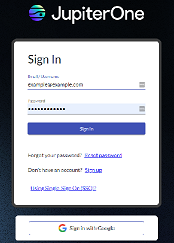

# JupiterOne 13 January 2022 Release

January 13, 2022

## New Features and Improvements

- There is a new login experience and new look-and-feel for the search page. 
  

-  For previously created account API tokens, the policies for those APIs are now viewable. 

## Fixes and Resolutions

- Release notes have moved to a new naming convention. Instead of aligning with our internal sprint numbers, we are now using the actual date.

## Integrations

### Google Workspace

- Fixed an issue that was causing duplicate `_key` values for `google_mobile_device` assets.

### Okta

- Improved the retry logic to ensure successful completion when 500 errors are occasionally returned.
- Improved error messaging so that you know when a 403 error has resulted from a permissions issue that you can resolve yourself.

### Jamf

- Improved how firewall assets are populated.

### GitHub

- Added a new `active` Boolean property to the `github_user` asset.

### Qualys

- Changed the `qualysAssetId` asset to use the `Asset ID` class,
- Added the `qualysQWebHostId` property to the `discovered_host` asset.

## Coming Soon

- Compliance Version 2.0: Major updates to the Compliance App are in the works, and are slated for release in the coming weeks. 

- Compliance Version 2.0 includes the centralization and re-usability of controls, a new look and feel, and improved navigation within the App.

