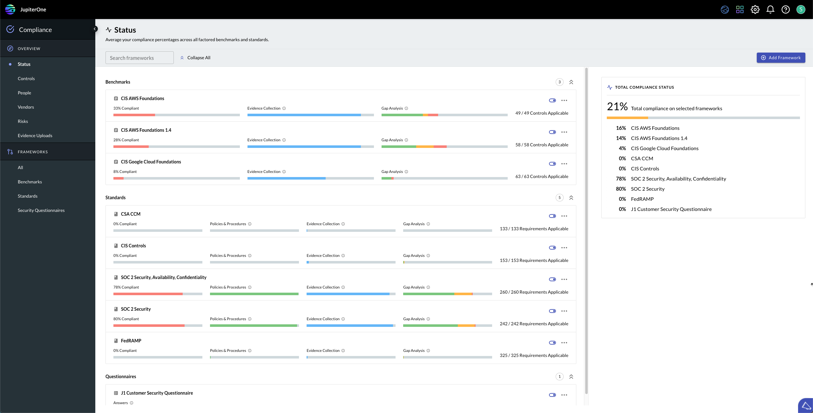

# JupiterOne 31 January 2022 Compliance Version 2.0 Release
## January 31, 2022

## New Features and Improvements
Compliance Version 2.0 is now live and available in JupiterOne today! This update includes the following enhancements:

- The look-and-feel for Compliance is updated and reflects a refreshed organizational flow.

 
- Actions taken within Compliance are now driven by a new left navigation bar and organizes actions into two camps: Frameworks and tertiary actions.

- All controls are now located in a central repository called the Controls Library, allowing for controls to be reused between frameworks and benchmarks. 

- Filtering by value with a compliance framework is now supported, allowing for faster navigation to compliance gaps, evidence, and applicable controls. 

- Frameworks are now broken out into separate views, allowing for better navigation. 
  
  - Frameworks are sorted into Benchmarks, Standards, and Security Questionnaires.

- The Control Library is paginated, allowing for the selection of the number of rows displayed per page.

- When implemented, controls now have updated statutes to better reflect their impact on a requirement/framework.

- SOC-2 Framework offers best-in-class support, and follows the latest framework.

- Linked requirements are visible from the Controls detail page, allowing for clear insight into how controls in an environment are implemented. 

- Editing topical properties for requirements, sections, frameworks are supported and made available via a dialog box. 
